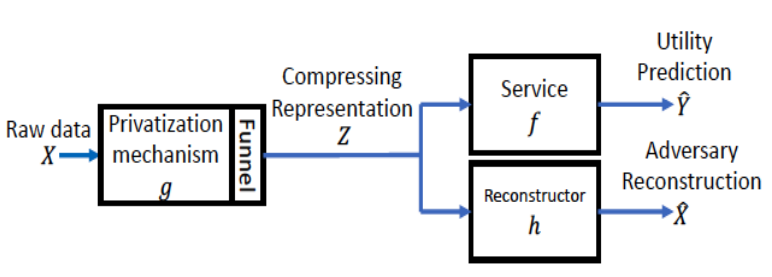
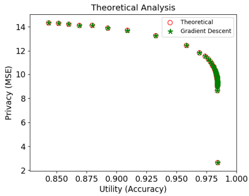
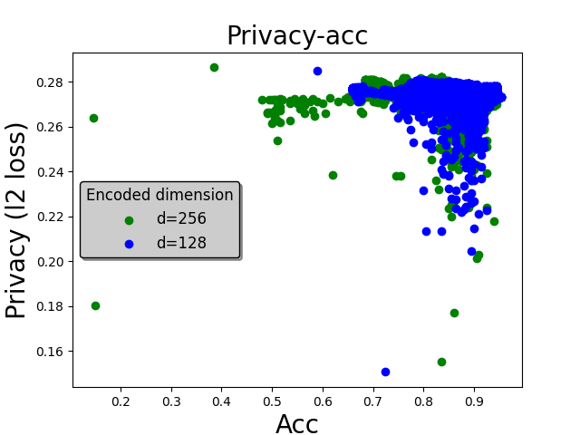

# 隱私加密-CPGAN (Compressive Privacy Generative Adversarial Network)
## File說明
face_net.py：檔案的先處理，抓臉部用的
CPGAN_prototype.py：重建器為NN
CPGAN_CNN.py：重建器為CNN，ACC比較高與穩健，推薦使用
CPGAN_load.py：載入檔案用的

## 前言

什麼是隱私加密呢？鑑於現在大數據分析盛行，數據在彼此之間可能會有安全性的隱憂

例如說醫院手中有病人的病歷、住址、身分證字號，萬一流出去的後果可能會很嚴重

如果只是對數據的主鑑primary key進行加密可能還不夠，因為有其他cross reference還是可以進行數據還原

所以接下來要提到的是差分隱私的概念，如何去定義數據隱私這件事情

## 差分隱私

對於某個鄰集 $D_1$跟 $D_2$，我們使用加密算法 $\mathscr{A}$，兩個set之間的差距為$e^\epsilon$

$\epsilon$越趨近於0，代表我們對於兩個鄰集無法辨認的程度越高

也就是無法獲得更多的資訊，代表隱私保護程度越高

$$
\mathbb{P}\left[\mathscr{A}\left(D_1\right) \in S\right] \leq e^\epsilon \mathbb{P}\left[\mathscr{A}\left(D_2\right) \in S\right]
$$


## CPGAN


回到正題，做加密有很多的方式，涉及了密碼學，那我們今天有沒有一種不是人工去design的方式來構建我們的加密？所以今天就介紹CPGAN的方式來進行加密

這邊主要是想用NN的架構來做隱私加密，這邊是把NN的黑盒子當成加密的演算法，輸出就是一串數字


在這邊的GAN主要分成加密g跟解密h：

<div align=center></div>

本文引用，主要介紹並復現這篇的工作

B. -W. Tseng and P. -Y. Wu, "Compressive Privacy Generative Adversarial Network," in IEEE Transactions on Information Forensics and Security, vol. 15


### 加密器

這邊通常是直接使用先前分類器任務的NN，擷取到某一層

以圖像分類來說就是CNN最後一層不要拉分類的softmax，只有到中間的hidden layers

輸出就是一串數字，我們稱為code

   
### 構建分類器：輸入這些數字CODE，輸出分類器

以圖像分類來說這邊可以做事情有很多，最簡單就是輸入為code輸出直接拉softmax

想要訓練效果比較好的可以做triple loss：每一張圖片輸出一個code，跟自己分類相同的code應該要有比較小的loss，跟自己分類不同的應該要比較大的loss

所以triple loss的定義為前者扣掉後者


誤差函數使用cross entropy跟輸出$\mathbf{z}_i$跟分類$\mathbf{y}_i$之間的距離

$$
L_{util}=-\frac{1}{m} \sum_{i=1}^m \log P_f\left(\mathbf{y}_i \mid \mathbf{z}_i\right)
$$

更新參數於分類器

### 再來是重構器：輸入這些數字，輸出為最一開始的input

輸入為code，輸出為$\hat{\mathbf{x}}$與原來的圖片$\mathbf{x}$作為對照

這邊使用的loss function選用Linear Ridge Regression

可以收斂到一個global solution
$$
L_{a d v}^{L R R}=\frac{1}{m} \sum_{i=1}^m\left\|\hat{\mathbf{x}}_{i, L R R}-\mathbf{x}_i\right\|_2^2
$$

更新參數於重構器
### 最後是重構器跟分類器的衡量函數

$$L_{CPGAN}=\lambda L_{util}-L_{adv}$$

參數更新於加密器上

# 訓練training code

## 前處理
先前處理一下圖片，用一下mtcnn這個網路架構把臉截下來
```
from facenet_pytorch import MTCNN,InceptionResnetV1

mtcnn = MTCNN(image_size=92)
```
圖片文件內總共400張圖片，共10個分類

mtcnn功能為人臉辨識，可以捕捉人臉範圍，prob對應到人臉可能性的分數
```
path='./CPGAN_example/pre-process/pic'
for i in range(1,41):
    for j in range(1,11):
        x= cv2.cvtColor(cv2.imread('att_faces/s{}/{}.pgm'.format(i,j)), cv2.COLOR_BGR2RGB)
        x_aligned, prob = mtcnn(x, return_prob=True,save_path=path+str(i)+'_'+str(j)+'.jpg')
```

原圖為92x112的灰階圖片，這邊我截成92x92

(沒什麼必要做這步，主要就是比較一般化一些)
## 處理參數初始化用的function

```
def weights_init(net, init_type='normal', init_gain=0.02):
    def init_func(m):
        classname = m.__class__.__name__
        if hasattr(m, 'weight') and classname.find('Conv') != -1:
            if init_type == 'normal':
                torch.nn.init.normal_(m.weight.data, 0.0, init_gain)
            elif init_type == 'xavier':
                torch.nn.init.xavier_normal_(m.weight.data, gain=init_gain)
            elif init_type == 'kaiming':
                torch.nn.init.kaiming_normal_(m.weight.data, a=0, mode='fan_in')
            elif init_type == 'orthogonal':
                torch.nn.init.orthogonal_(m.weight.data, gain=init_gain)
            else:
                raise NotImplementedError('initialization method [%s] is not implemented' % init_type)
        elif classname.find('BatchNorm2d') != -1:
            torch.nn.init.normal_(m.weight.data, 1.0, 0.02)
            torch.nn.init.constant_(m.bias.data, 0.0)
    print('initialize network with %s type' % init_type)
    net.apply(init_func)
```

## 分類器
```
class Classifier(nn.Module):
    def __init__(self):
        super(Classifier, self).__init__()
        self.fc = nn.Linear(Encoder_dimension, 40)    
    def forward(self, x):
        x = self.fc(x)
        #x= F.softmax(x)
        return x
```

## 載入檔案
用cv2載入要在/255 訓練效果會比較好

有些人也會在訓練前把它map到一個常態分布上
```
import cv2
for i in range(1,41):
    for j in range(1,11):
        data=cv2.imread('./CPGAN_example/pre-process/pic'+str(i)+'_'+str(j)+'.jpg',cv2.IMREAD_GRAYSCALE)
        data=data.reshape([1,92,92])/255
        #print(data)

        if j <= 5:
            raw_train_data.append(data)
            train_true.append(i-1)
            #train_true_one_hot.append(np.eye(40)[i-1])
        else:
            raw_test_data.append(data)
            test_true.append(i-1)
```


## 計算0/1 acc用的function
```
def compare_labels(labels,test_label):
    correct=0
    for i in range(len(labels)):
        if test_label[i]==labels[i]:
            correct=correct+1
    acc=correct/len(labels)
    return acc
```

## 定義oracle 指導訓練過程 
torch裡會用的function

為了方便辨識，定義以下的indexes：

0就是分類器用的 

1就是重構器用的 

2是編碼器用的
```
encoder = Encoder()

classifier=Classifier()


### define the loss function and optimizer
### 0:Classier, 1:constructor
criterion0 = nn.CrossEntropyLoss()
criterion1= nn.MSELoss()


optimizer0 = optim.Adam(classifier.parameters(), lr=0.001,  weight_decay=1e-6)
optimizer2 = optim.Adam(encoder.parameters(), lr=0.001,  weight_decay=1e-6)
```

index=0的時候是classier的訓練過程要到它收斂
```
def oracle(index,data,labels,*raw_data):
    ###0:Classier:return the outcome of prediction
    if index==0:
        #criterion0 = nn.CrossEntropyLoss()
        #optimizer0 = optim.Adam(classifier.parameters(), lr=0.001,  weight_decay=1e-6)
        loss_list=[]
        dif_loss=1
        loss_value=1
        count_dif_reverse=0
        count=0
        while True:
            optimizer0.zero_grad()
            outputs=classifier(data)
            loss0 = criterion0(outputs, labels)
            loss0.backward() ###retain_graph=True
            optimizer0.step()
            loss_value=loss0.item()
            #print('count',count,'loss',loss_value)
            if count==0:
                pass
            else:
                dif_loss=loss_list[-1]-loss_value
            if dif_loss<=1e-6:
               count_dif_reverse=count_dif_reverse+1
            if count_dif_reverse>=1000:
                break 
            #print(count,dif_loss)
            loss_list.append(loss_value)
            count=count+1
            if count>=20000:
                break
            
        return  loss0, outputs

    elif index==1:
```
1的時候是重構器，手刻方程式就行
```
    ###1:reconstruction: return prediction and loss
        #criterion1 = nn.MSELoss()
        ridge_cof=0.001
        Encoder_dimension=data.shape[1]
        raw_data=raw_data[0]
        raw_data=raw_data.reshape([200,-1])
        img_len=raw_data.shape[1]
        matrix_sum1=torch.zeros([Encoder_dimension,Encoder_dimension])
        matrix_sum2=torch.zeros(Encoder_dimension,img_len)
        for i in range(len(data)):
            vec_z=data[i,:].reshape([-1,1])
            vec_x=raw_data[i,:].reshape([-1,1])
            matrix_sum1=matrix_sum1+vec_z*vec_z.t()
            matrix_sum2=matrix_sum2+vec_z*vec_x.t()
        W_LRR=torch.matmul(torch.linalg.inv(matrix_sum1/len(data)+ridge_cof*torch.eye(Encoder_dimension)),matrix_sum2/len(data))

        x_reconstructed=torch.matmul(W_LRR.t(),data.t())
        loss1=criterion1(x_reconstructed, raw_data.t())
        return loss1, x_reconstructed
```

最後是編碼器的更新，遞迴函數，自己呼叫自己

trade_off_const就是上面的$\lambda$
```
    elif index==2:

        optimizer0.zero_grad()
        outputs=classifier(data)
        loss0 = criterion0(outputs, labels)
        loss1, x_reconstructed=oracle(1,data,labels,*raw_data)
        gen_loss=trade_off_const*loss0-loss1
        optimizer2.zero_grad()
        gen_loss.backward()
        optimizer2.step()
        return gen_loss
    else:
        return None
```


##主程式

初始化
```
weights_init(encoder)
```

這邊的data都是指經過編碼器後的code

data是給內部迴圈更新分類器跟重構器用的，要detach

data2是給外部迴圈更新編碼器用的code
```
data = encoder(raw_data_train).detach()
data2= encoder(raw_data_train)       
```

分類器結果
```
loss0, outputs0=oracle(0,data,labels)
```
做一下cross validation，拿err 跟 acc
```
code_test_data=encoder(test_data)
outputs_test=classifier(code_test_data)
label_trained=torch.argmax(outputs0,1)
label_test=torch.argmax(outputs_test,1)
err=compare_labels(labels,label_trained)
acc=compare_labels(labels,label_test)
```
重構器的結果，這個loss function我們可以當作是隱私函數
```
loss1, x_reconstructed=oracle(1,data,labels,raw_data)
loss_value=loss1.item()
```
再來是衡量函數，整個GAN的核心來更新encoder
```
gan_loss=oracle(2,data2,labels,raw_data)
print(err,acc,loss_value)
```

算完記得存檔
```
err_list.append(err)
acc_list.append(acc)
loss1_list.append(loss_value)      
dic={'err_list':err_list,'acc_list':acc_list,'loss1_list':loss1_list}
fp=open('./CPGAN_example/CPGAN_CNN_d_'+str(Encoder_dimension)+'.pkl', 'wb')
pickle.dump(dic, fp)

```

## 訓練過程
這邊的loss function是重建器的loss (它不是GAN的loss)

這是一件我們希望看的到事情，我們會想找到某種加密的function，隨著訓練的開始，重建的難度越高，才是一個好的隱私加密模式。

這邊的trail是指每一個trail 裡面等到分類器跟重建器都收斂，再更新一次加密器

<div align=center></div>

再看看ACC的表現怎麼樣，就算一開始沒有找到很好的ACC的點，這個演算法也會幫助找到比較，也許是重建的概念是可以幫助圖片辨識有更好的表現，但隨著重建數據的難度越高，ACC其實也因為可利用性降低而下降。

<div align=center></div>

## 訓練結果
我們可以對照一下paper內的Theoretical 結果

<div align=center></div>

我們來測試一百個不同的初始點，每個初始點做100個trial，總共10000個點

再實作上就是看可以忍受的Acc到多少，去挑靠近右上方的點，就可以找到理想的加密模式。

<div align=center></div>