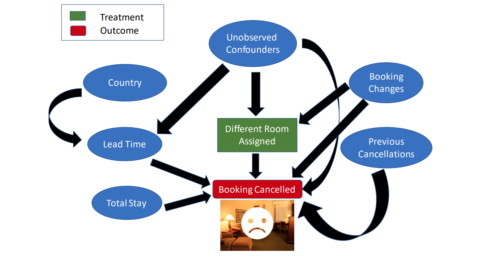
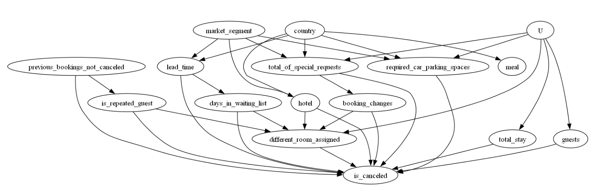

# 旅館取消訂房分析
<div align=center></div>

以這個例子來說，

1. 顧客在哪個國家會影響到交付時間(Lead time)，如果交付時間太長，也許會影響到最終做了取消的決定
2. 顧客的喜好會影響到他們對房間的調整，也會影響到最後的決定
3. 假如這個顧客放鳥的歷史紀錄本來就很多，也許最後也會取消房間

因果分析可以處理很複雜的場景，尤其是在眾多混淆因子的影響下

要如何很好的處理因果關係都是很大的問題

以下是一些比較系統性的處理方式，並利用Dowhy包來進行實作


## 資料集欄位說明
原資料集欄位說明：
https://github.com/rfordatascience/tidytuesday/blob/master/data/2020/2020-02-11/readme.md

## 因果解析
原代碼出處：
https://github.com/py-why/dowhy/blob/main/docs/source/example_notebooks/DoWhy-The%20Causal%20Story%20Behind%20Hotel%20Booking%20Cancellations.ipynb

以下是我們會用到的包
```
import pandas as pd
import numpy as np
import matplotlib.pyplot as plt
import dowhy
from IPython.display import Image, display
```

先看一下數據
```
dataset = pd.read_csv('https://raw.githubusercontent.com/Sid-darthvader/DoWhy-The-Causal-Story-Behind-Hotel-Booking-Cancellations/master/hotel_bookings.csv')
dataset.head()
dataset.columns
```

資料說明可以看

```
Index(['hotel', 'is_canceled', 'lead_time', 'arrival_date_year',
       'arrival_date_month', 'arrival_date_week_number',
       'arrival_date_day_of_month', 'stays_in_weekend_nights',
       'stays_in_week_nights', 'adults', 'children', 'babies', 'meal',
       'country', 'market_segment', 'distribution_channel',
       'is_repeated_guest', 'previous_cancellations',
       'previous_bookings_not_canceled', 'reserved_room_type',
       'assigned_room_type', 'booking_changes', 'deposit_type', 'agent',
       'company', 'days_in_waiting_list', 'customer_type', 'adr',
       'required_car_parking_spaces', 'total_of_special_requests',
       'reservation_status', 'reservation_status_date'],
      dtype='object')
```


把某些欄位合起來一下，讓資訊更簡潔
```
# Total stay in nights
dataset['total_stay'] = dataset['stays_in_week_nights']+dataset['stays_in_weekend_nights']
# Total number of guests
dataset['guests'] = dataset['adults']+dataset['children'] +dataset['babies']
# Creating the different_room_assigned feature
dataset['different_room_assigned']=0
slice_indices =dataset['reserved_room_type']!=dataset['assigned_room_type']
dataset.loc[slice_indices,'different_room_assigned']=1
# Deleting older features
dataset = dataset.drop(['stays_in_week_nights','stays_in_weekend_nights','adults','children','babies'
                        ,'reserved_room_type','assigned_room_type'],axis=1)
```
缺失值補齊，這邊是用眾數來進行填補

```
dataset.isnull().sum() # Country,Agent,Company contain 488,16340,112593 missing entries 
dataset = dataset.drop(['agent','company'],axis=1)
# Replacing missing countries with most freqently occuring countries
dataset['country']= dataset['country'].fillna(dataset['country'].mode()[0])
dataset = dataset.drop(['reservation_status','reservation_status_date','arrival_date_day_of_month'],axis=1)
dataset = dataset.drop(['arrival_date_year'],axis=1)
dataset = dataset.drop(['distribution_channel'], axis=1)
# Replacing 1 by True and 0 by False for the experiment and outcome variables
dataset['different_room_assigned']= dataset['different_room_assigned'].replace(1,True)
dataset['different_room_assigned']= dataset['different_room_assigned'].replace(0,False)
dataset['is_canceled']= dataset['is_canceled'].replace(1,True)
dataset['is_canceled']= dataset['is_canceled'].replace(0,False)
dataset.dropna(inplace=True)
```

因為資料本身是不平衡的，所以這邊我們做重複抽樣
其中我們想知道如果在booking的時候對進行資料的更改會不會對最後面的取消會有影響

```
# Expected Count when there are booking changes = 66.4%
counts_sum=0
for i in range(1,10000):
        counts_i = 0
        rdf = dataset[dataset["booking_changes"]>0].sample(1000)
        counts_i = rdf[rdf["is_canceled"]== rdf["different_room_assigned"]].shape[0]
        counts_sum+= counts_i
counts_sum/10000
```
我們可以得到大概66.4%，貌似好像是booking_change正相關的關係，但這是正確的結論嗎？

以下我們就來看驗證看看different_room_assigned對最終的決定有沒有因果關係

在introduction的時候我們就強調，相關性並不等於因果關係。

這邊我們就利用Dowhy的包來驗證看看

首先我們需要建立一下我們對因果的假設
```
causal_graph = """digraph {
different_room_assigned[label="Different Room Assigned"];
is_canceled[label="Booking Cancelled"];
booking_changes[label="Booking Changes"];
previous_bookings_not_canceled[label="Previous Booking Retentions"];
days_in_waiting_list[label="Days in Waitlist"];
lead_time[label="Lead Time"];
market_segment[label="Market Segment"];
country[label="Country"];
U[label="Unobserved Confounders",observed="no"];
is_repeated_guest;
total_stay;
guests;
meal;
hotel;
U->{different_room_assigned,required_car_parking_spaces,guests,total_stay,total_of_special_requests};
market_segment -> lead_time;
lead_time->is_canceled; country -> lead_time;
different_room_assigned -> is_canceled;
country->meal;
lead_time -> days_in_waiting_list;
days_in_waiting_list ->{is_canceled,different_room_assigned};
previous_bookings_not_canceled -> is_canceled;
previous_bookings_not_canceled -> is_repeated_guest;
is_repeated_guest -> {different_room_assigned,is_canceled};
total_stay -> is_canceled;
guests -> is_canceled;
booking_changes -> different_room_assigned; booking_changes -> is_canceled; 
hotel -> {different_room_assigned,is_canceled};
required_car_parking_spaces -> is_canceled;
total_of_special_requests -> {booking_changes,is_canceled};
country->{hotel, required_car_parking_spaces,total_of_special_requests};
market_segment->{hotel, required_car_parking_spaces,total_of_special_requests};
}"""
```
建立一下模型，順便畫一下圖，這裡
```
model= dowhy.CausalModel(
        data = dataset,
        graph=causal_graph.replace("\n", " "),
        treatment="different_room_assigned",
        outcome='is_canceled')

# model.view_model()
# display(Image(filename="causal_model.png",width=600))
```

<div align=center></div>

這邊要先檢驗一下這些variable是不是identified的

```
estimate = model.estimate_effect(identified_estimand, 
                                 method_name="backdoor.propensity_score_weighting",target_units="ate")
# ATE = Average Treatment Effect
# ATT = Average Treatment Effect on Treated (i.e. those who were assigned a different room)
# ATC = Average Treatment Effect on Control (i.e. those who were not assigned a different room)
print(estimate)
```
```
Estimand assumption 1, Unconfoundedness: If U→{different_room_assigned} and U→is_canceled then P(is_canceled|different_room_assigned,total_of_special_requests,is_repeated_guest,lead_time,guests,hotel,days_in_waiting_list,required_car_parking_spaces,total_stay,booking_changes,U) = P(is_canceled|different_room_assigned,total_of_special_requests,is_repeated_guest,lead_time,guests,hotel,days_in_waiting_list,required_car_parking_spaces,total_stay,booking_changes)

### Estimand : 2
Estimand name: iv
No such variable(s) found!

### Estimand : 3
Estimand name: frontdoor
No such variable(s) found!
```

既然這些variables都是可辨識的，那就可以開始進行處理了

```
estimate = model.estimate_effect(identified_estimand, 
                                 method_name="backdoor.propensity_score_weighting",target_units="ate")
# ATE = Average Treatment Effect
# ATT = Average Treatment Effect on Treated (i.e. those who were assigned a different room)
# ATC = Average Treatment Effect on Control (i.e. those who were not assigned a different room)
print(estimate)
```

看一下結果居然是負向的關係

也就是說，改的資料越多反而是比較不會發生訂房取消的現象

但這邊的測量是基於我們的因果假設就是長上面那張圖

那假如，今天不是這張圖呢？那我們就可以做一些統計來進行各種的驗證
```
Random Common Cause:
- Adds randomly drawn covariates to data and re-runs the analysis to see if the causal estimate changes or not. 
If our assumption was originally correct then the causal estimate shouldn't change by much.
'''
refute1_results=model.refute_estimate(identified_estimand, estimate,
        method_name="random_common_cause")
print(refute1_results)

'''
Placebo Treatment Refuter:- Randomly assigns any covariate as a treatment and re-runs the analysis. 
If our assumptions were correct then this newly found out estimate should go to 0.
'''
refute2_results=model.refute_estimate(identified_estimand, estimate,
        method_name="placebo_treatment_refuter")
print(refute2_results)
'''
Data Subset Refuter:- Creates subsets of the data(similar to cross-validation) 
and checks whether the causal estimates vary across subsets. 
If our assumptions were correct there shouldn't be much variation.
'''
refute3_results=model.refute_estimate(identified_estimand, estimate,
        method_name="data_subset_refuter")
print(refute3_results)
```

```
Refute: Add a random common cause
Estimated effect:-0.34483090494986424
New effect:-0.34483090494986435
p value:1.0

Refute: Use a Placebo Treatment
Estimated effect:-0.34483090494986424
New effect:0.09329799150603722
p value:0.0

Refute: Use a subset of data
Estimated effect:-0.34483090494986424
New effect:-0.34479684096020835
p value:0.98
```

經過各式各樣的統計驗證，我們可以更加相信，這個因果關係是存在的

