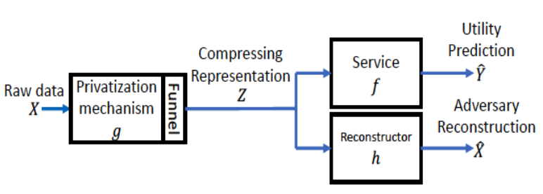

# Project-recongnition
這邊就放一些跟我覺得有趣的實作，有時候還還沒完全完工，忍一下。

或是有些不知道要放哪裡的side-project也會放這

# CPGAN 壓縮隱私生成式對抗網路

隨著大數據時代的發展，數據隱私的問題也逐漸浮現出來

如何對數據進行加密，並還能保持一定的可利用性都是一個問題

這篇實作是利用 CPGAN 來找一種對資料加密的演算法，並可以找到好的可利用性，主要是復現以下這篇文章

B. -W. Tseng and P. -Y. Wu, "Compressive Privacy Generative Adversarial Network," in IEEE Transactions on Information Forensics and Security, vol. 15

# YT_recommend_anyalysis

此處以YT「反正我很閒」，觀眾的回覆與影片的內容為資訊來源

YT評論文字雲：YT評論爬蟲+文字切片+字頻分析

YT影片精華摘取-最大觀看回顧：YT連結獲取爬蟲+最大回顧爬蟲+YT影片爬蟲+信號處理+自動剪片

YT影片內容摘要：YT聲音爬蟲+(人聲強化)+聲音轉文字+(文檔糾錯)+字頻分析

# Customer-Churn
資料集來源取至Kaggle:Telco Customer Churn

從IBM服務的資料中可以看到顧客率流失率很高

從一些簡單的圖表可以做初步原因的面向探討

嚴謹一點可以使用統計檢驗與因果推斷

這邊也順便做了SVM + Auto machine learning來調參

# Danchro_randown_egg
有些遊戲就是需要好一點的首抽開局才會玩得開心

很多時候刷首抽只是一些重複且無聊的動作，這邊是實作如何用pyautogui解放雙手

玩遊戲基本上就是看到什麼東西，然後我們再進行動作，這邊在利用open-cv做圖片辨識

主要是要把目標的文字抓出來再去做動作

註：這裡只有教學如何寫code

