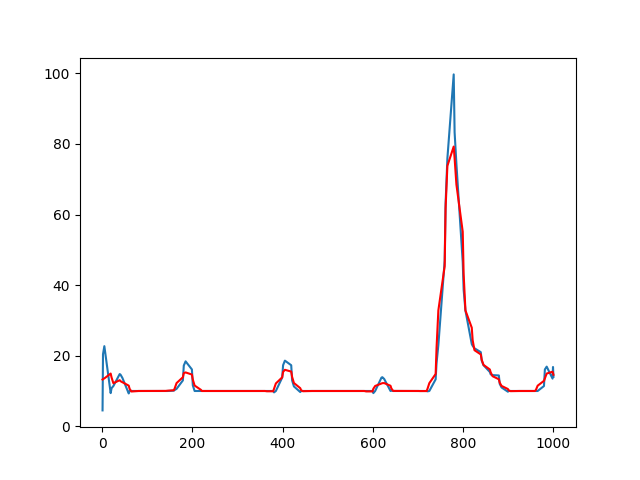

# YT合作推薦分析

假設你今天是一個產品廠商，今天想跟某個YT合作，這個時候你應該也沒有時間看所有有關這名TY的影片

那有沒有什麼方式，可以讓你很快地獲得跟這名YT有關的資訊

或是比較有效率的方式可以看到這位創作者的風格

這個時候關鍵字分析或是搜索就有它的重要性


# 功能
1. YT評論文字雲：YT評論爬蟲+文字切片+字頻分析
2. YT影片最大觀看回顧摘取：YT影片連結獲取爬蟲+最大回顧爬蟲+YT影片爬蟲+信號處理+自動剪片
3. YT影片內容摘要：YT聲音爬蟲+(人聲強化)+聲音轉文字+(文檔糾錯)+字頻分析

# YT評論文字雲

首先是資料來源：影片內容或是評論，我們可以利用爬蟲去取得

再來是解析手法：主要是切片後再字頻分析


## yt_crawler_get_url_from_YT_channel.py
首先我們先輸入YT Channel連結，輸出為所有YT的影片連結

這邊做的事情只是從YT vedio標籤從下滾到底並且爬取所有的影片連結

並存成字典dict_url.pkl

## yt_crawler_get_comments_from_vedio_page.py

獲取連結後，我們需要再一樣滾到底爬取所有的評論，順便爬取關於這些影片的資訊

並存成字典dict_vedio.pkl

## yt_cloud_word.py
獲取這些文字之後，我們再利用中研院工具ckiptagger做文字切片

切片完再用word_cloud工作產生文字雲

先import 包
```
import re
import numpy as np
import pickle
from ckiptagger import data_utils, construct_dictionary, WS, POS, NER
from wordcloud import WordCloud
import matplotlib.pyplot as plt
```

讀取txt文件，不讀最後一個\n字符
```
def read_path_txt_to_list(path):
    result=[]
    f = open(path, "r",encoding='utf-8')
    for line in f:
        result.append(line[:-1])
    return result
```

讀取檔案
```
font_path='C:/Windows/Fonts/kaiu.ttf'
stop_words_path='./YT_analysis/stop_words_zh.txt'
stop_words_list=read_path_txt_to_list(stop_words_path)
stop_words_set=set(stop_words_list)


fp=open('./YT_analysis/dict_vedios.pkl', 'rb')
new_data=pickle.load(fp)
###filter out non-chinese word
for i in range(len(new_data['list_comment'])):
    comment_list=new_data['list_comment'][i]
    for j in range(len(comment_list)):
        comment=comment_list[j]
        match_obj =re.findall(r'[\u4e00-\u9fa5]',comment)
        comment_list[j]=''.join(match_obj)

```

載入WS切片工具，要把model讀進檔案內

```
ws = WS("./data", disable_cuda=False)
```

先簡單清洗一下，只把中文讀進去
```
for i in range(len(new_data['list_comment'])):
    comment_list=new_data['list_comment'][i]
    for j in range(len(comment_list)):
        comment=comment_list[j]
        match_obj =re.findall(r'[\u4e00-\u9fa5]',comment)
        comment_list[j]=''.join(match_obj)
```

決定以下存儲容器

fre_dic={} 用來存字頻的字典 (frequency)

tf_dic={} 用來存字頻率的字典 (relative frequency)

df_dic={} 用來存句與句間字頻的字典 (frequency)

tf_idf_dic={} 存td-idf的字典
```
or i in range(0,len(new_data['list_comment'])):
    comment_list=new_data['list_comment'][i]
    # comment_list=all_comment_list
    fre_dic={}
    tf_dic={}
    df_dic={}
    tf_idf_dic={}
    word_s = ws(comment_list,sentence_segmentation=True,segment_delimiter_set=stop_words_set)
    word_s_selected=[]
```

count用來算總字頻

tmp_df_dic用來暫存，不要再同一個句字內重複統計，後面再放進df_dic裡面

fre_dic就把字頻存進去

把註解拿掉就是只看兩個字組成的詞 bi-word


```
    count=0
    for sentence in word_s:
        tmp=[]
        tmp_df_dic={}
        for word in sentence:
            if word not in stop_words_list:
                # if len(word)>=2:
                tmp.append(word)
                if word in fre_dic.keys():
                    fre_dic[word]+=1
                else:
                    fre_dic[word]=1
                count=count+1
                tmp_df_dic[word]=1
        word_s_selected.append(tmp)

        for word,fre in tmp_df_dic.items():
            if word in df_dic.keys():
                df_dic[word]+=1
            else:
                df_dic[word]=1
```

就把 tf跟tf_idf算出來，順便sort一下，印出來看看
```
    for word,fre in fre_dic.items():
        tf_dic[word]=fre/count
        tf_idf_dic[word]=fre/count*np.log(len(word_s)/(df_dic[word]+1))

    print(sorted(fre_dic.items(),key=lambda item:item[1],reverse=True))
    print(sorted(tf_idf_dic.items(),key=lambda item:item[1],reverse=True))
```

wc把code取出來

```
    wc = WordCloud(background_color="white",width=1000,height=1000, max_words=30,relative_scaling=0.5,normalize_plurals=False,font_path=font_path).generate_from_frequencies(fre_dic)
    wc2 = WordCloud(background_color="white",width=1000,height=1000, max_words=30,relative_scaling=0.5,normalize_plurals=False,font_path=font_path).generate_from_frequencies(tf_idf_dic)
    wc.to_file('./YT_analysis/word_cloud/wc_fre_from.'+str(i)+'.png')
    wc2.to_file('./YT_analysis/word_cloud/wc_tf_idf_from.'+str(i)+'.png')
```

## 總覽
以下先來看總覽，抓取所有影片下觀眾的回覆可以看到的標籤
<div align=center></div>

以我對他們的印象，頻道的內梗大概都在這了

## 點閱數前三
以下來演示一下，依照反正我很閒YT channel裡面點閱數排名前三的

```
fp=open('./YT_analysis/dict_vedios.pkl', 'rb')
new_data=pickle.load(fp)
new_data=pd.DataFrame(new_data)
print(new_data.sort_values('views',ascending=False))
```

```
                                                 title  length    views like_message    watch_message                                       list_comment
75       【卑鄙源之助】卑鄙狂人：卑鄙源之助的一天！與卑鄙零距離，今年最流行的生活方式！｜反正我很閒      99  4268702         7.1萬  觀看次數：4,268,702次  卑鄙到連救生衣都不穿了, 神奇演算法又帶 我回來回味。我才發現原來卑鄙源之助是在疫情初期上架...
133               【人民的法槌】社畜救星！ 教你如何爭取權益，徹底反抗慣老闆！｜反正我很閒     314  3934659         4.6萬  觀看次數：3,934,659次  一個只會吠然後到處借錢的人高喊打倒資本主義\r\n跟 一個苟延殘喘在資本主義下沒力氣思考的 ...
73   【電影劇組 爆笑雷包】業界大牌導演 頭上三把火！電影影視劇組工作出包！攝影師傻眼！全場驚呼 ...     336  3879106         6.7萬  觀看次數：3,879,106次  「啊我就怕被罵咩」\n這句話欠打程度\n跟「 爛命一條」差不多, 今天這個成本目測大概有個4...
65                 【海龍王彼得】海鮮餐廳 時價爭議！ 一尊稱霸海上的龍王！| 反正我很閒     215  2779877         4.9萬  觀看次數：2,779,877次  很少看到越熟的人叫的稱呼越長的，不愧是海龍王彼得, 沙 魚-450\n軟絲-850\n花蟹-...
77   【惡魔貓男】貓奴注意！貓的制裁降臨人間！貢獻社會的時刻到了！來自底層廢物的覺醒 化身黑暗使者...     223  2407496         3.1萬  觀看次數：2,407,496次  鍾佳播宇宙是不是要開始擴張了, 為什麼連 貓的演技都可以這麼優秀?, 惡魔貓男湊對成功率比浪...
```

點閱率第一的
<div align=center></div>
第二
<div align=center></div>
第三
<div align=center></div>

我們從bi-word的再看一次

<div align=center></div>

<div align=center></div>

<div align=center></div>

## 業配點閱率前三
對於廠商來說，可能有興趣的是那麼業配影片是怎麼樣？，我們把有業配標籤抓出來
```
                                                 title    views
【大業配時代】流量就是一切！神秘廠商來襲！業配成功真相！feat.魏德聖 | 反正我很閒  1944256
【贖罪之路】上班偷打電動！自我放逐！最後連道歉也給不起！！ | 反正我很閒  1511721
【黃金三兄弟】追逐夢想掏金夢！三兄弟其利斷金！好日子要來了！ feat.餵飽豬 | 反正我很閒  1509245
```
<div align=center></div>

<div align=center></div>

<div align=center></div>


如果我們將所有影片的評論湊合起來


# YT影片最大觀看回顧摘取
以上我們透過標籤化的方式，幫助我們透過觀眾的回饋，把這些影片做了標籤化

再來，我們從YT最高回顧觀看來分析看看這些影片的特色是什麼


## yt_crawler_get_vedio_from_row_heat_map
這個code會用到的包
```
import pickle
import re
import matplotlib.pyplot as plt
import numpy as np
from scipy.signal import savgol_filter
from pytube import YouTube
from moviepy.editor import *
from bs4 import BeautifulSoup
from selenium import webdriver
import time
from selenium.webdriver.common.by import By
```

前面就是把heat_map的資料爬進來
要篩選一下C開頭C結尾的部分才是x,y上面的data
```
find_all_list=re.findall('C.*?C',row_data)
x_list=[]
y_list=[]
for one_list in find_all_list:
    string=one_list[2:-2]
    split_list=re.split(' ',string)
    for one_split_list in split_list:
        x_y_list=re.split(',',one_split_list)
        x_list.append(float(x_y_list[0]))
```
原資料的y軸是倒過來的，要把它轉回來
```
        y_list.append(100-float(x_y_list[1]))
```

再來原始資料是需要做平滑化，因為我們接下來需要把區間的波段抓出來

有做平滑化後，區間內的單調關係會比較好，後續抓波段的演算法可以寫得比較簡單

藍色為原始數據，紅色為轉換後的數據，

這邊我們savgol_filter的算法取到一階就很夠用了

```
y_hat_list=savgol_filter(y_list, 5, 1)
plt.plot(x_list,y_list)
plt.plot(x_list,y_hat_list, color='red')
plt.show()
```

<div align=center></div>

這邊我們先把影片切成前中後再三段，再透過峰值把三個區段抓出來

time_split_list就儲存了我們抓到的波段

```
y_list=y_hat_list
number_of_max=3
print(len(x_list))
print(len(y_list))
intervel=int(len(x_list)/3)

time_split_list=[]
for i in range(number_of_max):
    #print(i)
    tmp_y_list=y_list[0+i*intervel:(i+1)*intervel]
    # print(0+i*intervel,(i+1)*intervel)
    left_index=np.argmax(tmp_y_list)+i*intervel
    #print(left_index)
    right_index=left_index.copy()
    #往左走
    if left_index==i*intervel:
        pass
    else:
        while y_list[left_index]>y_list[left_index-1]:
            if left_index==(i)*intervel:
                #print('l touch the bound')
                break
            left_index=left_index-1
        #print('now right index',right_index,left_index)
        #print((i+1)*intervel)
    if right_index==(i+1)*intervel-1:
        pass
    else:
        while y_list[right_index]>y_list[right_index+1]:
            #print(right_index,(i+1)*intervel)
            if right_index==(i+1)*intervel:
                #print('r touch the bound')
                break    
            right_index=right_index+1
    time_split_list.append([left_index,right_index])
```

後續再把影片根據時間條摘取出來
```
path='./YT_analysis/vedio_tmp/'
###下載原檔
yt.streams.filter().get_highest_resolution().download(filename=path+url_str+'.mp4')
video = VideoFileClip(path+url_str+'.mp4')


all_sub_path=[]
###根據時間條分割影片
for i in range(number_of_max):
    start_time=time_split_list[i][0]/len(x_list)*yt_length
    end_time=time_split_list[i][1]/len(x_list)*yt_length
    output = video.subclip(start_time,end_time)
    output.write_videofile(path+url_str+str(i)+'.mp4',temp_audiofile="temp-audio.m4a", remove_temp=True, codec="libx264", audio_codec="aac")
    all_sub_path.append(path+url_str+str(i)+'.mp4')
```

再來我們來加點轉場特效

```
def transitions_animation(clip_video1, clip_video2): 
    """ 
    兩段視訊中轉場動畫（以淡入淡出為例） 
    注意：保證視訊拍攝幀率一致 
    :param video1: 
    :param video2: 
    :return: 
    """ 
    # 獲取視訊時長 

    duration_video1 = clip_video1.duration 

    duration_video2 = clip_video2.duration 

    # 獲取視訊音訊 

 
    audio_video1 = clip_video1.audio
    audio_video2 = clip_video2.audio
 

 
    print(f'兩段視訊的時長分別為:{duration_video1},{duration_video2}') 
 
    # 統一視訊解析度 
    w, h, fps = clip_video1.w, clip_video1.h, clip_video1.fps 
    clip_video2_new = clip_video2.resize((w, h)) 
 
    # 轉場時長，預設2s 
    transitions_time = 2 
 
    # 第一段視訊執行淡出效果 
    subVideo1_part1 = clip_video1.subclip(0, duration_video1 - 2) 
    subVideo1_part2 = clip_video1.subclip(duration_video1 - 2).fadeout(2, (1, 1, 1)) 
 
    # 第二段視訊執行淡入效果 
    subVideo2_part1 = clip_video2_new.subclip(0, 3).fadein(3, (1, 1, 1)) 
    subVideo2_part2 = clip_video2_new.subclip(3) 
 
    # 合併4段視訊 
    result_video = concatenate_videoclips([subVideo1_part1, subVideo1_part2, subVideo2_part1, subVideo2_part2]) 
 
    # 合併音訊 
    result_audio = concatenate_audioclips([audio_video1, audio_video2]) 
 
    # 視訊設定音訊檔案 
    final_clip = result_video.set_audio(result_audio)
    return final_clip


for i in range(len(all_sub_path)-1):
    if i==0:
        clip_video1 = VideoFileClip(all_sub_path[i])
        clip_video2 = VideoFileClip(all_sub_path[i+1])
        vedio=transitions_animation(clip_video1, clip_video2)
    else:
        clip_video2 = VideoFileClip(all_sub_path[i+1])
        vedio=transitions_animation(vedio, clip_video2)

vedio.write_videofile(path+url_str+'_final_edit'+'.mp4',temp_audiofile="temp-audio.m4a", remove_temp=True, codec="libx264", audio_codec="aac")
```


## 前言
觀眾喜歡的是戲劇效果？什麼是戲劇效果，就是角色或者背景故事在觀眾心中發生了衝突

就算是業配影片，觀眾還是需要娛樂效果

這邊我們藉由上述的演算法，來體驗一下在這樣演算法中看到的元素有什麼
## 大業配時代


<source src="./YT_analysis/vedio_tmp/LUaYe_7cmxQ_final_edit.mp4" type="video/mp4">

[![大業配時代]](./YT_analysis/vedio_tmp/LUaYe_7cmxQ_final_edit.mp4 "大業配時代")

https://github.com/fluttering13/Project-recongnition/blob/main/YT_analysis/vedio_tmp/LUaYe_7cmxQ_final_edit.mp4

第一段是主角們茫然發現沒寫劇本

第二段導演拿了蟑欲絕的畫面順便荒謬進入界配畫面

第三段是終於導演身上都充滿了業配商品

## 贖罪之路

<source src="./YT_analysis/vedio_tmp/_wH5lSI5Dgw_final_edit.mp4" type="video/mp4">

[![贖罪之路]](./YT_analysis/vedio_tmp/_wH5lSI5Dgw_final_edit.mp4 "贖罪之路")

https://github.com/fluttering13/Project-recongnition/blob/main/YT_analysis/vedio_tmp/_wH5lSI5Dgw_final_edit.mp4

第一段是女主角與男主角的互動

第二段是女主角的哭戲

第三段是樂咖進入了茫然模式

## 黃金三兄弟


<source src="./YT_analysis/vedio_tmp/obqrIjodgWY_final_edit.mp4" type="video/mp4">


[![黃金三兄弟]](./YT_analysis/vedio_tmp/obqrIjodgWY_final_edit.mp4 "黃金三兄弟")

https://github.com/fluttering13/Project-recongnition/blob/main/YT_analysis/vedio_tmp/./YT_analysis/vedio_tmp/obqrIjodgWY_final_edit.mp4

第一段是大哥的訓導

第二段是繼續被訓

第三段是又是繼續被訓，最後只變成主角成為上頭

## 總整理
主要片段基本上以憤怒、悲傷、狂笑等情緒為主導。通常會融合劇情，主要是觀眾想看的「戲劇衝突」為主導。對於想要業配的作品，應該是把作品呈現在衝突劇情點上面會通常更可以達到宣傳的成效。


# YT影片內容摘要
除了從觀眾回饋獲得影片資訊內容，感覺更有效的是直接從影片內的文本挖掘

直接獲取第一手的資訊


## yt_crawler_get_audio.py

從之前的get_url可以獲取dict_url.pkl

從這邊我們根據要的影片再去爬

```
save_path='./YT_analysis/audio/'
fp=open('./YT_analysis/dict_url.pkl', 'rb')
urls=pickle.load(fp)
url=urls['url_list'][63]
code=get_url_code(url)

yt=YouTube(url)
file_path='./YT_analysis/audio/'+code+'.mp3'
new_file_path='./YT_analysis/audio/'+code+'.wav'
yt.streams.filter().get_audio_only().download(filename=file_path)

# print(os.path.isfile(file_path))
subprocess.call(['ffmpeg', '-i', file_path, new_file_path])
```

## yt_denoise3.py
這邊我們直接使用VoiceFixer這個開源包來幫助我們做人聲強化

但效果不一定robust，可能比較好的做法是針對這個YT角色的聲音再去做fine-tune

這邊我們直接使用這個包，或是不做去噪這個步驟
```
from voicefixer import VoiceFixer, Vocoder

path = './YT_analysis/audio/6F25QdYp02w.wav'
save_path='./YT_analysis/audio/6F25QdYp02w_denoise.wav'

path2 = './YT_analysis/audio/6F25QdYp02w2.wav'
save_path2='./YT_analysis/audio/6F25QdYp02w_denoise2.wav'
# Initialize model
voicefixer = VoiceFixer()
# Speech restoration
# Mode 0: Original Model (suggested by default)
# Mode 1: Add preprocessing module (remove higher frequency)
# Mode 2: Train mode (might work sometimes on seriously degraded real speech)
voicefixer.restore(input=path, # input wav file path
                   output=save_path, # output wav file path
                   cuda=False, # whether to use gpu acceleration
                   mode = 0) # You can try out mode 0, 1 to find out the best result

## Initialize a vocoder
# Universal speaker independent vocoder
vocoder = Vocoder(sample_rate=44100) # Only 44100 sampling rate is supported.
### read wave (fpath) -> mel spectrogram -> vocoder -> wave -> save wave (out_path)
# Convert mel spectrogram to waveform
#wave = vocoder.forward(mel=mel_spec) # This forward function is used in the following oracle function.

# Test vocoder using the mel spectrogram of 'fpath', save output to file out_path
vocoder.oracle(fpath=path, # input wav file path
               out_path=save_path2) # output wav file path
```


## yt_audio_to_text_speech_recognition.py

這裡我們使用openAI whisper的包來幫助做speech to text的工作
```
from datasets import load_dataset
from transformers import Wav2Vec2ForCTC, Wav2Vec2Processor
import pickle
import whisper
from whisper.utils import get_writer


# code='6F25QdYp02w'

folder_path='./YT_analysis/audio_to_text/'
file_path='./YT_analysis/audio/obqrIjodgWY.wav'
name=''
count=0
dot_count=0
for word in file_path:
    if count==3:
        name=name+word
    if word=='/':
        count=count+1
    if word=='.':
        dot_count=dot_count+1
    if dot_count==2:
        break

model = whisper.load_model("base")
result = model.transcribe(file_path)
fp=open(folder_path+name+'_reuslt.pkl', 'wb')
pickle.dump(result, fp)

txt_writer = get_writer("txt", folder_path)
writer_args = {'highlight_words': False, 'max_line_count': None, 'max_line_width': None}
txt_writer(result, name, writer_args)

srt_writer = get_writer("srt", folder_path)
srt_writer(result, name, writer_args)
```

## yt_text_correction.py
correction是使用hugging face上面開源的模型ChienseBERT-for-csc

原始檔通常會是蠻慘的狀況，這個時候需要文本糾錯

```
import pickle
from transformers import AutoTokenizer, AutoModel
from opencc import OpenCC

tokenizer = AutoTokenizer.from_pretrained("iioSnail/ChineseBERT-for-csc", trust_remote_code=True)
model = AutoModel.from_pretrained("iioSnail/ChineseBERT-for-csc", trust_remote_code=True)


corrected_list=[]
for i in range(len(all_text_list)):
    input_text=tw2sp.convert(all_text_list[i])
    inputs = tokenizer(input_text, return_tensors='pt')
    output_hidden = model(**inputs).logits
    result_text=''.join(tokenizer.convert_ids_to_tokens(output_hidden.argmax(-1)[0, 1:-1]))
    corrected_list.append(s2twp.convert(result_text))
    fp=open('./YT_analysis/corrected_text/'+name+'_corrected_text_list.pkl', 'wb')
    pickle.dump(corrected_list, fp)

with open('./YT_analysis/corrected_text/'+name+'_corrected_text.txt', 'w') as fp:
    for item in corrected_list:
        fp.write("%s\n" % item)    
```

糾錯前
```
等一下
等一下
等一下
欸 都看到了
好 剛剛喔
你可以包一個嗎嗎
我同時在我們家門口
你去幫我擋住他一下
擋住 幹嘛擋住
欸我還來跟我們藥店
我是還電腦給他借欸
欸你沒事跟他藥店嗎
他這台是A7啦
就比我那台快啊
我這台已經給他借兩個月
我兩個優勤就要還他
我這台45分鐘結束了啦
你把我去 放我托一下
45分鐘就好
他要找家庫
你要你要你要
家庫他說他在忙啊
那個
欸你他哪邊有朋友
我剛剛才有朋友
......
```
糾錯後，好像差不多，但就是把文字統一一下
```
等一下
等一下
等一下
欸都看到了
好剛剛喔
你可以包一個嗎嗎
我同時在我們家門口
你去幫我擋住他一下
擋住幹嘛擋住
欸我還來跟我們藥店
我是換電腦給她借欸
欸你沒事跟他藥店嗎
他這臺是a7啦
就比我那臺快啊
我這臺已經給她借兩個月
我兩個優勤就要還他
我這胎45分鐘結束了啦
你把我去放我託一下
45分鐘就好
他要找家當
你要你要你要
家庫他說他在忙啊
那個
欸你她那邊有朋友
```
## yt_cloud_word2

這邊跟yt_cloud_word差不多，我們直接看結果
<div align=center></div>

<div align=center></div>


<div align=center></div>