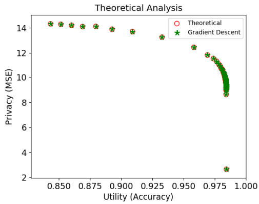

# 隱私加密-CPGAN (Compressive Privacy Generative Adversarial Network)
## File說明
Find_face_by_mtcnn.py：前處理，抓臉部，產生data用的
CPGAN_CNN.py：重建器為CNN，ACC比較高與穩健，推薦使用
CPGAN_load.py：載入檔案用的

## 前言

什麼是隱私加密呢？鑑於不同的應用場景需求，數據在彼此之間可能會有安全性的隱憂，例如銀行的客戶資料、醫院的病患資料，要解決這個痛點有很多方法與流程，其中一個流程就是做好加密。

例如說醫院手中有病人的病歷、住址、身分證字號，萬一流出去的後果可能會很嚴重

有一個比較直覺的方式就是對數據的主鍵primary key (user_id, 身份證字號 之類的) 進行加密可能還不夠，因為有可能再其他的醫院沒有做這件事情，或是透過有相關性的其他欄位去推測，也就是其他的cross reference還是可以進行數據還原。

所以接下來要提到的是差分隱私的概念，如何去定義數據隱私這件事情。

這邊先提要一下，加密一定會影響到可利用性，加密相當於把訊息模糊了，也就是欄位的特徵會消失不見，這對回歸問題來說是很不利的，所以要如何取得一個平衡也是一個值得關注的重點。

## 差分隱私

今天想要知道一個算法它好不好我們就需要定義一下

對於某個鄰集 $D_1$跟 $D_2$，我們使用加密算法 $\mathscr{A}$，兩個set之間的差距為 $e^\epsilon$

$\epsilon$是一個非負參數，其越趨近於0，這個上界就越趨近於1，代表我們對於兩個鄰集無法辨認的程度越高

也就是無法獲得更多的資訊，代表隱私保護程度越高

$$
\mathbb{P}\left[\mathscr{A}\left(D_1\right) \in S\right] \leq e^\epsilon \mathbb{P}\left[\mathscr{A}\left(D_2\right) \in S\right]
$$

接下來來介紹在CPGAN是如何去構件這個演算法 $\mathscr{A}$

## CPGAN


回到正題，做加密有很多的方式，涉及了密碼學，那我們今天有沒有一種不是人工去design的方式來構建我們的加密？所以今天就介紹CPGAN的方式來進行加密

這邊主要是想用NN的架構來做隱私加密，這邊是把NN的黑盒子當成加密的演算法，輸出就是一串數字


在這邊的GAN主要分成加密 $g$ 跟解密 $h$

<div align=center></div>

本文引用，主要介紹並復現這篇的工作

B. -W. Tseng and P. -Y. Wu, "Compressive Privacy Generative Adversarial Network," in IEEE Transactions on Information Forensics and Security, vol. 15


### 加密器

這邊通常是直接使用通常分類器任務的NN，擷取到某一層

以圖像分類來說就是CNN最後一層不要拉分類的softmax，只有到中間的hidden layers

輸出就是一串數字，我們稱為code

   
### 構建分類器：輸入這些數字CODE，輸出分類器

以圖像分類來說這邊可以做事情有很多，最簡單就是輸入為code輸出直接拉softmax

想要訓練效果比較好的可以做triple loss：每一張圖片輸出一個code，跟自己分類相同的code應該要有比較小的loss，跟自己分類不同的應該要比較大的loss

所以triple loss的定義為前者扣掉後者


誤差函數使用cross entropy跟輸出 $\mathbf{z}_i$ 跟分類 $\mathbf{y}_i$ 之間的距離

$$
L_{util}=-\frac{1}{m} \sum_{i=1}^m \log P_f\left(\mathbf{y}_i \mid \mathbf{z}_i\right)
$$

更新參數於分類器

### 再來是重構器：輸入這些數字，輸出為最一開始的input

輸入為code，輸出為 $\hat{\mathbf{x}}$ 與原來的圖片 $\mathbf{x}$ 作為對照

這邊使用的loss function選用Linear Ridge Regression

可以收斂到一個global solution

$$
L_{a d v}^{L R R}=\frac{1}{m} \sum_{i=1}^m\left\|\hat{\mathbf{x}}_{i, L R R}-\mathbf{x}_i\right\|_2^2
$$

更新參數於重構器
### 最後是重構器跟分類器的衡量函數

$$L_{CPGAN}=\lambda L_{util}-L_{adv}$$

有多個loss function 在收斂上就會比較tricky了，參數更新於加密器上

# 訓練training code

## 前處理
[前處理：產生臉](../CPGAN_example/CPGAN_example/find_face_by_MTCNN.py)

先前處理一下圖片，用一下mtcnn這個網路架構把臉截下來
```
from facenet_pytorch import MTCNN,InceptionResnetV1

mtcnn = MTCNN(image_size=92)
```
圖片文件內總共400張圖片，共10個分類

mtcnn功能為人臉辨識，可以捕捉人臉範圍，prob對應到人臉可能性的分數
```
path='./CPGAN_example/pre-process/pic'
for i in range(1,41):
    for j in range(1,11):
        x= cv2.cvtColor(cv2.imread('att_faces/s{}/{}.pgm'.format(i,j)), cv2.COLOR_BGR2RGB)
        x_aligned, prob = mtcnn(x, return_prob=True,save_path=path+str(i)+'_'+str(j)+'.jpg')
```

原圖為92x112的灰階圖片，這邊我截成92x92

(這一步只是想讓原始圖片變成正方形，做一個資料處理的標準化)

## NN設定
[訓練用：網路初始化](../CPGAN_example/CPGAN_example/CPGAN_CNN_net.py)

### 參數初始化
通常情況是nomal就足夠用了，針對不同的distribution也許有好的初始化參數

任何參數的東西丟給optuna調就對了
```
def weights_init(net, init_type='normal', init_gain=0.02):
    def init_func(m):
        classname = m.__class__.__name__
        if hasattr(m, 'weight') and classname.find('Conv') != -1:
            if init_type == 'normal':
                torch.nn.init.normal_(m.weight.data, 0.0, init_gain)
            elif init_type == 'xavier':
                torch.nn.init.xavier_normal_(m.weight.data, gain=init_gain)
            elif init_type == 'kaiming':
                torch.nn.init.kaiming_normal_(m.weight.data, a=0, mode='fan_in')
            elif init_type == 'orthogonal':
                torch.nn.init.orthogonal_(m.weight.data, gain=init_gain)
            else:
                raise NotImplementedError('initialization method [%s] is not implemented' % init_type)
        elif classname.find('BatchNorm2d') != -1:
            torch.nn.init.normal_(m.weight.data, 1.0, 0.02)
            torch.nn.init.constant_(m.bias.data, 0.0)
    print('initialize network with %s type' % init_type)
    net.apply(init_func)
```

### Classifer
```
class Classifier(nn.Module):
    def __init__(self):
        super(Classifier, self).__init__()
        self.fc = nn.Linear(encoder_dimension, 40)    
    def forward(self, x):
        x = self.fc(x)
        return x
```

### Encoder

fc1_input_features跟原始圖片的shape與batch有關，如果輸入有變再去config.json調一下

Encoder其實只是原始CNN拔掉最後一層
```
class Encoder(nn.Module):
    def __init__(self):
        super(Encoder, self).__init__()
        self.conv1 = nn.Conv2d(in_channels=1, out_channels=3, kernel_size=(5, 5))
        self.relu1 = nn.ReLU()
        self.maxpool1 = nn.MaxPool2d(kernel_size=(2, 2), stride=(2, 2))
        self.conv2 = nn.Conv2d(in_channels=3, out_channels=5,kernel_size=(5, 5))
        self.relu2 = nn.ReLU()
        self.maxpool2 = nn.MaxPool2d(kernel_size=(2, 2), stride=(2, 2))
        self.fc1 = nn.Linear(in_features=fc1_input_features, out_features=encoder_dimension)
        self.Dropout    = nn.Dropout(1 - 0.5)        
        self.last_bn = nn.BatchNorm1d(encoder_dimension, eps=0.001, momentum=0.1, affine=True)

    def forward(self, x):
        x = self.conv1(x)
        x = self.relu1(x)
        x = self.maxpool1(x)
        x = self.conv2(x)
        x = self.relu2(x)
        x = self.maxpool2(x)       
        x = x.view(x.size(0), -1)
        x = self.fc1(x)
        before_normalize = self.last_bn(x)

        return before_normalize
```


## 計算0/1 acc用的function
[訓練用：自定義函數](../CPGAN_example/CPGAN_example/CPGAN_utilty.py)
```
def compare_labels(labels,test_label):
    correct=0
    for i in range(len(labels)):
        if test_label[i]==labels[i]:
            correct=correct+1
    acc=correct/len(labels)
    return acc
```


## 訓練過程與載入檔案
[訓練過程](../CPGAN_example/CPGAN_example/CPGAN_CNN_train.py)

### 載入檔案
用cv2載入要再/255 訓練效果會比較好

或者有些人也會在訓練前把它map到一個常態分布上

這邊是讀取圖片的灰階
```
def read_data_before_training(training_dict):# load data in grayscale

    raw_train_data=[]
    train_true=[]
    raw_test_data=[]
    test_true=[]
    for i in range(1,41):
        for j in range(1,11):
            #data=plt.imread('att_faces/s{}/{}.pgm'.format(i,j))
            #data='./CPGAN_example/pre-process/pic'+str(i)+'_'+str(j)+'.jpg'
            data=cv2.imread('./pre-process/pic'+str(i)+'_'+str(j)+'.jpg',cv2.IMREAD_GRAYSCALE)
            data=data.reshape([1,92,92])/255
            #print(data)

            if j <= 5:
                raw_train_data.append(data)
                train_true.append(i-1)
            else:
                raw_test_data.append(data)
                test_true.append(i-1)

    raw_data=torch.from_numpy(np.array(raw_train_data)).float().reshape([200,1,92,92]).cuda()
    raw_data_train=torch.from_numpy(np.array(raw_train_data)).float().reshape([200,1,92,92]).cuda()
    labels=torch.from_numpy(np.array(train_true)).long().cuda()

    test_data=torch.from_numpy(np.array(raw_test_data))
    test_data=test_data.float().reshape([200,1,92,92]).cuda()

    training_dict['raw_train_data']=raw_train_data
    training_dict['raw_test_data']=raw_test_data
    training_dict['train_true']=train_true
    training_dict['test_true']=test_true
    training_dict['test_data']=test_data
    training_dict['raw_data']=raw_data
    training_dict['raw_data_train']=raw_data_train
    training_dict['labels']=labels
    
    return training_dict
```

### 定義訓練過程所用物件
torch標準起手式
```
def define_the_objs_in_training(training_dict):
    ###define the net
    encoder = Encoder().cuda()
    classifier=Classifier().cuda()

    ### define the loss function and optimizer
    ### 0:Classier, 1:constructor
    loss_CE_obj = nn.CrossEntropyLoss().cuda()
    loss_MSE_obj= nn.MSELoss().cuda()


    optimizer_classifier = optim.Adam(classifier.parameters(), lr=0.001,  weight_decay=1e-6)
    optimizer_encoder = optim.Adam(encoder.parameters(), lr=0.001,  weight_decay=1e-6)

    training_dict['encoder']=encoder
    training_dict['classifier']=classifier
    training_dict['loss_CE_obj']=loss_CE_obj
    training_dict['loss_MSE_obj']=loss_MSE_obj
    training_dict['optimizer_classifier']=optimizer_classifier
    training_dict['optimizer_encoder']=optimizer_encoder
    return training_dict
```

### 定義CPGAN_processing CPGAN核心算法

index是指在主程式裡面走哪個分流，主要有三個路線
分類器、重建器、跟最後的加密器

分類器主要走gradient descent 算法收斂就結束，算太久就跳開
```
def CPGAN_processing(index,training_dict):

    optimizer_classifier=training_dict['optimizer_classifier']
    optimizer_encoder=training_dict['optimizer_encoder']
    classifier=training_dict['classifier']
    loss_CE_obj=training_dict['loss_CE_obj']
    loss_MSE_obj=training_dict['loss_MSE_obj']

    
    labels=training_dict['labels']

    trade_off_const=training_dict['trade_off_const']
    ###0:Classier:return the outcome of prediction
    if index=='classifier':
        #criterion0 = nn.CrossEntropyLoss()
        #optimizer0 = optim.Adam(classifier.parameters(), lr=0.001,  weight_decay=1e-6)
        data=training_dict['data_detach']
        loss_list=[]
        dif_loss=1
        loss_value=1
        count_dif_reverse=0
        count=0
        while True:
            optimizer_classifier.zero_grad()
            outputs=classifier(data)
            loss_classifer = loss_CE_obj(outputs, labels)
            loss_classifer.backward() ###retain_graph=True
            optimizer_classifier.step()
            loss_value=loss_classifer.item()
            #print('count',count,'loss',loss_value)
            if count==0:
                pass
            else:
                dif_loss=loss_list[-1]-loss_value
            if dif_loss<=1e-6:
               count_dif_reverse=count_dif_reverse+1
            if count_dif_reverse>=1000:
                break 
            #print(count,dif_loss)
            loss_list.append(loss_value)
            count=count+1
            if count>=20000:
                break
        return  loss_classifer, outputs
```
重建器只是找最接近原始圖片的解，這邊是ridge算法可以拿到global的解
```
    elif index=='reconstructor':
    ###1:reconstruction: return prediction and loss
        #criterion1 = nn.MSELoss()
        data=training_dict['data_detach']
        raw_data=training_dict['raw_data']
        ridge_cof=0.001
        encoder_dimension=data.shape[1]

        raw_data=raw_data.reshape([200,-1])
        img_len=raw_data.shape[1]
        matrix_sum1=torch.zeros([encoder_dimension,encoder_dimension]).cuda()
        matrix_sum2=torch.zeros(encoder_dimension,img_len).cuda()
        for i in range(len(data)):
            vec_z=data[i,:].reshape([-1,1])
            vec_x=raw_data[i,:].reshape([-1,1])
            matrix_sum1=matrix_sum1+vec_z*vec_z.t()
            matrix_sum2=matrix_sum2+vec_z*vec_x.t()
        W_LRR=torch.matmul(torch.linalg.inv(matrix_sum1/len(data)+ridge_cof*torch.eye(encoder_dimension).cuda()),matrix_sum2/len(data))

        x_reconstructed=torch.matmul(W_LRR.t(),data.t())
        loss_reconstructor=loss_MSE_obj(x_reconstructed, raw_data.t())
        return loss_reconstructor, x_reconstructed
```
最後一步是encoder，要綜合上面兩個部份，拿到gan loss在更新網路參數

這邊比較好的寫法是直接複製算好的loss obj，這裡只是要強調不能直接拿原本不然會loss更新兩次的問題
```    
    elif index=='encoder':
        data=training_dict['data_encoder']
        optimizer_classifier.zero_grad()
        outputs=classifier(data)
        loss_classifer = loss_CE_obj(outputs, labels)
        loss_reconstructor, x_reconstructed=CPGAN_processing('reconstructor',training_dict)
        gan_loss=trade_off_const*loss_classifer-loss_reconstructor
        optimizer_encoder.zero_grad()
        gan_loss.backward()
        optimizer_encoder.step()

        training_dict['data_encoder']=data
        return gan_loss
    else:
        return None
```

### 主程式

初始化
```
weights_init(encoder)
```

這邊的data都是指經過編碼器後的code

data是給內部迴圈更新分類器跟重構器用的，要detach

data2是給外部迴圈更新編碼器用的code
```
data = encoder(raw_data_train).detach()
data2= encoder(raw_data_train)       
```

分類器結果
```
loss0, outputs0=oracle(0,data,labels)
```
做一下cross validation，拿err 跟 acc
```
code_test_data=encoder(test_data)
outputs_test=classifier(code_test_data)
label_trained=torch.argmax(outputs0,1)
label_test=torch.argmax(outputs_test,1)
err=compare_labels(labels,label_trained)
acc=compare_labels(labels,label_test)
```
重構器的結果，這個loss function我們可以當作是隱私函數
```
loss1, x_reconstructed=oracle(1,data,labels,raw_data)
loss_value=loss1.item()
```
再來是衡量函數，整個GAN的核心來更新encoder
```
gan_loss=oracle(2,data2,labels,raw_data)
print(err,acc,loss_value)
```

算完記得存檔
```
err_list.append(err)
acc_list.append(acc)
loss1_list.append(loss_value)      
dic={'err_list':err_list,'acc_list':acc_list,'loss1_list':loss1_list}
fp=open('./CPGAN_example/CPGAN_CNN_d_'+str(encoder_dimension)+'.pkl', 'wb')
pickle.dump(dic, fp)

```

## 讀取結果
這邊的loss function是重建器的loss (它不是GAN的loss)

這是一件我們希望看的到事情，我們會想找到某種加密的function，隨著訓練的開始，重建的難度越高，才是一個好的隱私加密模式。

這邊的trail是指每一個trail 裡面等到分類器跟重建器都收斂，再更新一次加密器

<div align=center></div>

再看看ACC的表現怎麼樣，就算一開始沒有找到很好的ACC的點，這個演算法也會幫助找到比較，也許是重建的概念是可以幫助圖片辨識有更好的表現，但隨著重建數據的難度越高，ACC其實也因為可利用性降低而下降。

<div align=center></div>

## 訓練結果
我們可以對照一下paper內的Theoretical 結果

<div align=center></div>

我們來測試一百個不同的初始點，每個初始點做100個trial，總共10000個點

再實作上就是看可以忍受的Acc到多少，去挑靠近右上方的點，就可以找到理想的加密模式。

<div align=center></div>